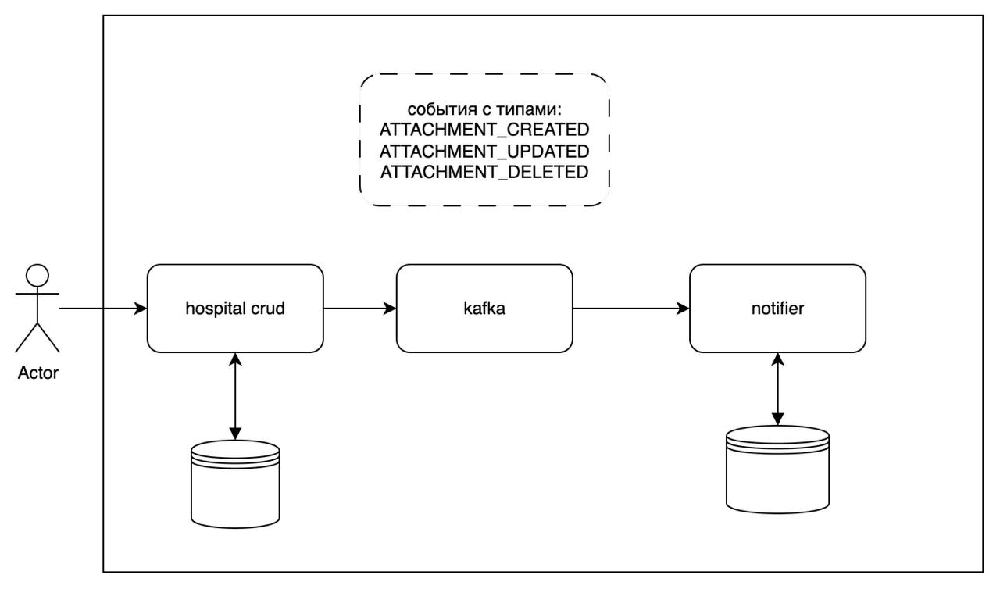

# 🏥 Сервис онлайн-записи к врачу с уведомлениями

Сервис для записи к врачу и нотификации о приближающемся посещении. Использована микросервсиная архитектура. Взаимодействие идет по REST-API. Данный проект - упрощенная реализация задачи.

Про core сервис можно почитать [здесь](testGaz/README.md)
Про сервис нотификации [здесь](testGaz/README.md)

# Архитектура сервиса управления пациентами. В идеальной картине мира, здесь не реализована

**Основные компоненты:**
- **CRUD-сервис** – создание, чтение, обновление и удаление записей пациентов.
- **Сервис уведомлений** – отправка и регулирование частоты уведомлений.

## Взаимодействие

1. При изменении данных пациента (через CRUD) событие публикуется в **Kafka**.
2. Для гарантированной доставки используется **Transactional Outbox**.
3. Дедупликация не требуется.

  
*Рис. 1. Взаимодействие компонентов системы*  

